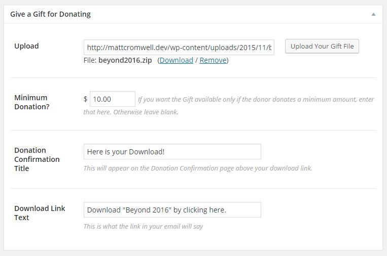
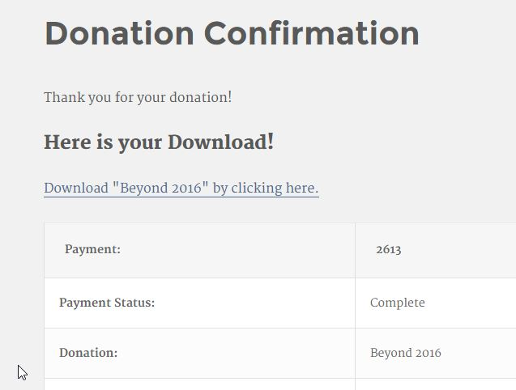
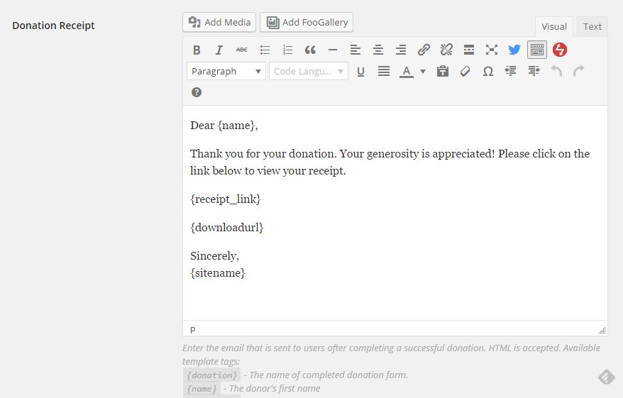
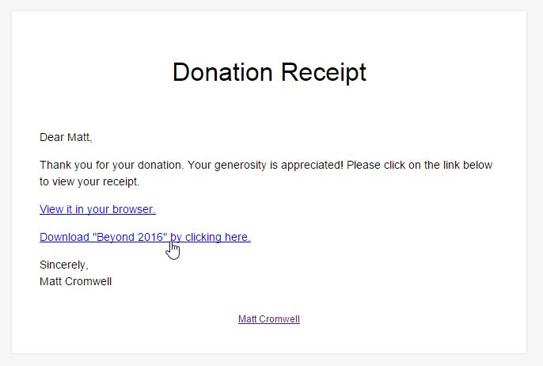

# GIVE RECEIPT ATTACHMENTS -- A Give Add-on
A [Give](https://givewp.com) Addon which allows you to add a file to any Give donation form and have it appear for your donors to download via the donation confirmation page and/or email donation receipt.

## FEATURES

* Choose custom title text for the confirmation page
* Choose custom link text for the attachment
* Upload your file via the Media Library Uploader
* Optionally set a minimum donation amount per form for the Attachment to be available to the donor.
* Add the link to your Admin notification email and/or the Donation receipt email via a custom Email tag.
* Forms that don't have uploads are not affected in any way.

## BASIC USAGE

At the bottom of each Give Form edit screen you'll find the Give Receipt Attachments settings area. You configure that per form. This includes the minimum donation amount necessary for the attachment to be available (optionally).

If you upload a file and configure the settings there, the attachment title and link will appear automatically before the Donation Receipt table on your Donation Confirmation page.

In order to have the attachment link appear in your donation receipt emails, go to "Donations > Settings" then the Emails tab. In the Donation Receipt email field add `{attachmenturl}` anywhere you like. Below that field you'll see a full list of all the available email tags.

## SCREENSHOTS

*Configure your Gift via the "Give a Gift for Donating" metabox on your Give form:*

*The Gift Title and Download link as seen on the Donation Confirmation page*

*Add the email tag {attachmenturl} to your donation receipt email for your donors to download straight from their email*

*The Attachment download link as seen in the Donor Email Receipt*

## ABOUT MATT CROMWELL

I'm Head of Support and Community Outreach at [WordImpress](https://wordimpress.com/). Our most popular plugin is [Give](https://wordpress.org/plugins/give), the leading donation plugin for WordPress. I build custom WordPress plugins and themes and blog frequently at [mattcromwell.com](https://www.mattcromwell.com/) on WordPress, Religion and Politics, and Family life.

If you are enjoying [Give Receipt Attachments](https://www.mattcromwell.com/products/give-receipt-attachments) please consider giving a donation to support my free plugin and theme development. All donations provided through my website go to [help San Diego nonprofit organizations with their hosting and web maintenance](https://www.mattcromwell.com/help-me-help-others/).

## ABOUT GIVE
[Give](https://wordpress.org/plugins/give) is the leading Donation Plugin for WordPress. Within one year Give received [over 100 5-star reviews](https://wordpress.org/support/view/plugin-reviews/give), and 10,000 active installs. Give is actively developed and supported. Find out more at [givewp.com](https://givewp.com). Read about our [Give Stories here](https://givewp.com/category/give-stories).